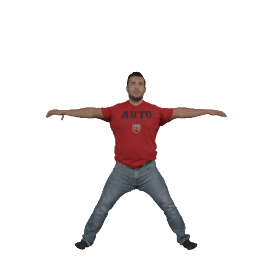
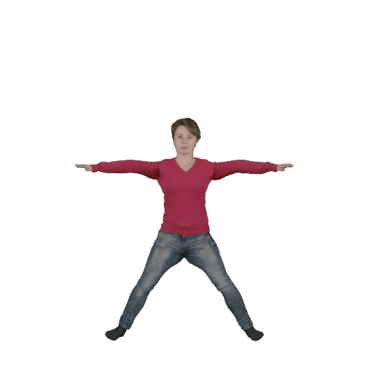
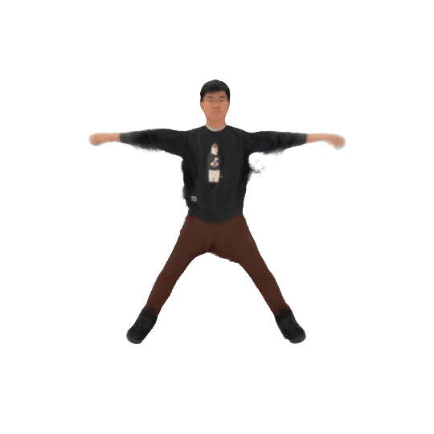
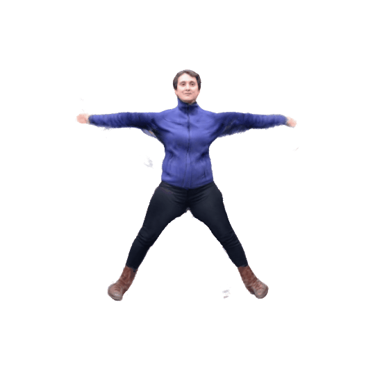

# InstantAvatar
[[Project Page]](https://tijiang13.github.io/InstantAvatar/)

## Install the dependencies
```
python -m venv env
source activate env/bin/activate
bash install.sh
```

## Prepare Data
```bash
# Step 1: Download data from: https://graphics.tu-bs.de/people-snapshot
# Step 2: Preprocess using our script
python scripts/peoplesnapshot/preprocess_PeopleSnapshot.py --root <PATH_TO_PEOPLESNAPSHOT> --subject male-3-casual

# Step 3: Download SMPL from: https://smpl.is.tue.mpg.de/ and place the model in ./data/SMPLX/smpl/
# └── SMPLX/smpl/
#         ├── SMPL_FEMALE.pkl
#         ├── SMPL_MALE.pkl
#         └── SMPL_NEUTRAL.pkl
```

## Quick Start
Quickly learn and animate an avatar with `bash ./bash/run-demo.sh`

<p float="left">


</p>

## Play with Your Own Video
Here we use the in the wild video provided by [Neuman](https://github.com/apple/ml-neuman) as an example:

1. create a yaml file specifying the details about the sequence in `./confs/dataset/`. In this example it's provided in `./confs/dataset/neuman/seattle.yaml`.
2. download the data from [Neuman's Repo](https://github.com/apple/ml-neuman), and run `cp <path-to-neuman-dataset>/seattle/images ./data/custom/seattle/`
3. run the bash script `bash scripts/custom/process-sequence.sh ./data/custom/seattle neutral` to preprocess the images, which
    - uses [Openpose](https://github.com/CMU-Perceptual-Computing-Lab/openpose) to estimate the 2D keypoints,
    - uses [Segment-Anything](https://github.com/facebookresearch/segment-anything) to segment the scene
    - uses [ROMP](https://github.com/Arthur151/ROMP) to estimate camera and smpl parameters
4. run the bash script `bash ./bash/run-neuman-demo.sh` to learn an avatar

<p float="left">
  
  
</p>

<p float="left">
  
  
</p>

And you can animate the avatar easily:


## Acknowledge
We would like to acknowledge the following third-party repositories we used in this project:
- [[Tinycuda-nn]](https://github.com/NVlabs/tiny-cuda-nn)
- [[Openpose]](https://github.com/CMU-Perceptual-Computing-Lab/openpose)
- [[ROMP]](https://github.com/Arthur151/ROMP)
- [[Segment-anything]](https://github.com/facebookresearch/segment-anything)

Besides, we used code from:
- [[Anim-NeRf]](https://github.com/JanaldoChen/Anim-NeRF)
- [[SelfRecon]](https://github.com/jby1993/SelfReconCode)
- [[lpips]](https://github.com/richzhang/PerceptualSimilarity)
- [[SMPLX]](https://github.com/vchoutas/smplx)
- [[pytorch3d]](https://github.com/facebookresearch/pytorch3d)

We are grateful to the developers and contributors of these repositories for their hard work and dedication to the open-source community. Without their contributions, our project would not have been possible.


## Related Works
Please also check out our related projects!
- [[Fast-SNARF]](https://github.com/xuchen-ethz/fast-snarf)
- [[Vid2Avatar]](https://github.com/MoyGcc/vid2avatar)

## Citation
```
@article{jiang2022instantavatar,
  author    = {Jiang, Tianjian and Chen, Xu and Song, Jie and Hilliges, Otmar},
  title     = {InstantAvatar: Learning Avatars from Monocular Video in 60 Seconds},
  journal   = {arXiv},
  year      = {2022},
}
```
